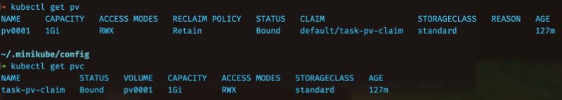
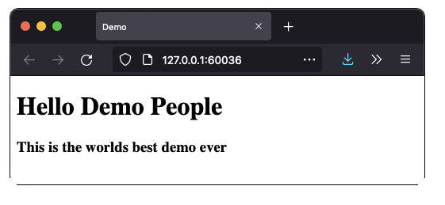
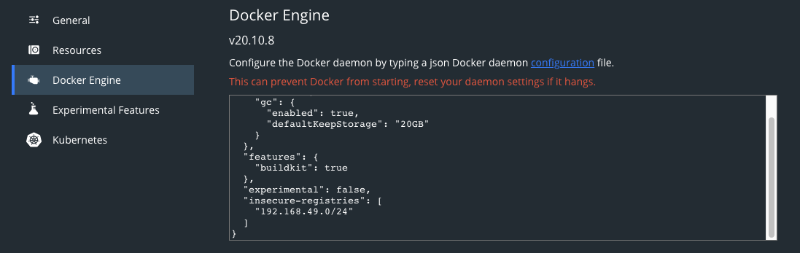
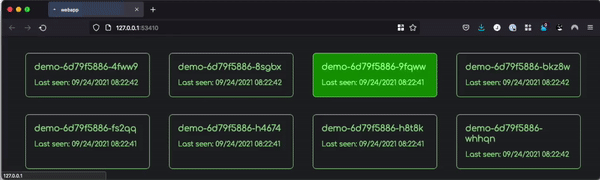

# Intro to kubernetes
This is a repo for resources for the technical demo held for NHN on September 23th 2021. 

Tools required:
* minikube
* docker desktop
* kubectl

## Creating a minikube cluster locally

The command for creating a new cluster is
```bash
minikube start
```
After that command is finished we can view our nodes with
```
kubectl get nodes
```

## NGINX Persistent Volume Demo
This is a demo for showing persistent volume (pv), persistent volume claim (pvc) with the use of a simple nginx container.

1. Mount local folder to minikube nodes
2. Apply persistant storage
3. Apply persistant storage claim
4. Deploy nginx container
5. Exposing nginx to the outside world
6. Visit website
7. Edit html locally
8. Visit website and verify change

### 1. Mount local folder to minikube (MacOSX)
Minikube has some predefined datafolders, and `/data` is one of them. I´m mounting a locally existing folder to my node with 
```
minikube mount /Users/jonasbg/kubernetes-demo/html:/data
```

### 2. Apply persistant storage
This is done by using `kubectl` and `apply`.
```
kubectl apply -f nginx/persistedvolume.yml
```

The file is fairly simple. The thing that is important here, is the `hostPath:` that must be pointed to any directory in `/data`. The name `pv0001` will create a subfolder with the same name.

`ReadWriteMany` defines that multiple nodes and pods can access this volume. The opposite is `ReadWriteOnce`.
```
apiVersion: v1
kind: PersistentVolume
metadata:
  name: pv0001
spec:
  storageClassName: standard
  accessModes:
    - ReadWriteMany
  capacity:
    storage: 1Gi
  hostPath:
    path: /data/pv0001/
```

### 3. Apply Persistant Volume Claim
This is done by the following command
```
kubectl apply -f nginx/persistedvolume-claim.yml
```
A Volume Claim is a claim for an available volume. The kubernetes resources will never have a direct relation to where or what the storage backend is, the only thing they care about is to get a volume they can use. The thing to note about this file is `ReadWriteMany` should be the same as the Volume, and the storage qouta should not be higher than whats available, for a claim to `bound` to a volume.
```
apiVersion: v1
kind: PersistentVolumeClaim
metadata:
  name: task-pv-claim
spec:
  accessModes:
    - ReadWriteMany
  resources:
    requests:
      storage: 512Mi
```

After these two resources are created, we can see that they are `Bound` to eachother by running
```
kubectl get pv
kubectl get pvc
```



### 4. Deploy nginx container
The nginx container will be inside a pod in kubernetes, and that pod must be deployed with a volumen mount attached.

We apply the deployment with
```
kubectl apply -f nginx/nginx.yml
```

When we look at the deployment yaml for nginx, there are some parts that are more important than others.
```
spec:
    volumes:
    - name: task-pv-storage
        persistentVolumeClaim:
        claimName: task-pv-claim
```
We are claiming the persitent volume claim we created earlier, and then later in our yaml file, we are mounting this claim to a spesific path inside our containers.
```
volumeMounts:
- mountPath: "/usr/share/nginx/html"
    name: task-pv-storage
```

After deployment we can view our pod with
```
kubectl get pods -o wide
```

### 5. Exposing nginx to the outside world
Our pod exists now only inside our cluster, there is nothing that can translate a request from the outside world and tunnel that to anything inside our cluster. To do that, we must create something that *services* that request to our pods. 

We must create a `service`, in our example of kind `LoadBalancer`. `LoadBalancer` is a special kind of service that is a trigger mechanism for cloud providers, which when used, will tell your hosting provider to give you a load balancer and bind that to an external ip. Minikube is not a hosting provider as such, but we kan access our services with minikube tunneling our services.

We create a service by binding the service to our application named `app: nginx-demo`.
```
kubectl expose deployment nginx-demo --port=80 --type=LoadBalancer
minikube service list
minikube service nginx-demo
```
The last command will open our web-browser and direct it to our site.



If we now change the content of our html file and reload, we should observe the change.


# 2nd Demo - Replica and LoadBalancing
The 2nd demo is for showing how the loadbalancer chooses different pods on must requests.
The app utilizes peer-to-peer node discovery to visualize which node is currently showing a webpage, and which other nodes that are in the cluster.

It is also a demonstration of how to use private registry in a local development environment.

First, create a new minikube cluster with `insecure-registry "10.0.0.0/24"` as parameter, and enable registries and metrics-server for loadbalancer to work correctly
```
minikube start insecure-registry "10.0.0.0/24"
minikube addons enable registry 
minikube addons enable metrics-server
```

Make sure that Docker is accepting insecure registries as well. The IP range is for our minikube cluster, get that with 
```
minikube ip
```



For this to work we need to have a fair share of replicas. When opening the site, a CPU intensive task is started to provoke a new pod when the next request is comming. 

**Do the following**
```
cd web
docker build -t localhost:5000/demo-image -f Dockerfile .
docker push localhost:5000/demo-image
kubectl create deployment demo --image=localhost:5000/demo-image --replicas=10 --port=80 --cpu-limits=1
kubectl expose deployment demo --port=80 --type=LoadBalancer
minikube service demo
```

When you now visit the site, it will jump between pods on the same node.

If you need to scale the number of replicas you can use
```
kubectl scale deployment demo --replicas=30
```


